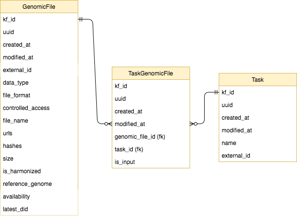

# Model Updates
 
## CavaticaTask Generalization
Up until this point we have only ingested harmonized files from Cavatica. Now we will also receive
harmonized files from the Broad Institute. 

### Implementation
We need to rename the models and fields to generalize the CavaticaTask and CavaticaTaskGenomicFile models.

### Migration
Migration should be fairly simple. It will consist of alter columns and alter table commands.
Also, we don't have any data in cavatica_task, cavatica_task_genomic_files tables.

## Multi-specimen Genomic Files
We decided that we will not have a separate model to represent multi-specimen genomic files. 
We will keep the many-to-many relationship between biospecimens and genomic files.

## Sequencing Experiments and Harmonized Files

People need to be able to search for files by various sequencing experiment attributes. There are 2 options for enabling this:

Option 1 - Move the relevant fields (i.e. experimental strategy, etc.) on the sequencing experiment to the genomic files.

Option 2 - Link sequencing experiments to both unharmonized and harmonized genomic files.
- Start populating the task, task_genomic_file tables when ingesting harmonized genomic files
- When a task_genomic_file entry is added, use the Task to find the linked unharmonized files for the given harmonized file,
- Get the linked sequencing experiments for the unharmonized files, and link the harmonized file to all of the sequencing experiments.
This would require the sequencing experiment genomic file relationship to be many-to-many. This option is not desirable.

