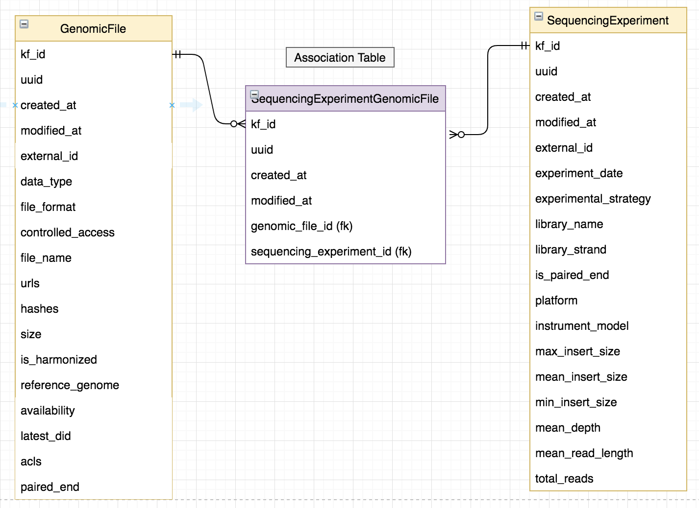

# Model Updates

## CavaticaTask Generalization
Up until this point we have only ingested harmonized files from Cavatica. Now we will also receive
harmonized files from the Broad Institute.

### Implementation
We need to rename the models and fields to generalize the CavaticaTask and CavaticaTaskGenomicFile models.

  

### Migration
Migration should be fairly simple. It will consist of alter columns and alter table commands.
Also, we don't have any data in cavatica_task, cavatica_task_genomic_files tables.

## Multi-specimen Genomic Files
We decided that we will not have a separate model to represent multi-specimen genomic files.
We will keep the many-to-many relationship between biospecimens and genomic files.

## Sequencing Experiments and Harmonized Files

A model change is needed to accommodate the use case: People want to search for harmonized genomic files by fields that describe the sequencing experiment that was performed on the associated unharmonized files.

See motivation for more details.

### Motivation
1. Really the "raw data" from a sequencing experiment is the read-level data, that is FASTQ, BAM, CRAMs - so they make the most sense to be directly tied to a sequencing experiment

2. Everything else, gVCF, VCF, etc is a processing level that is using that raw data to determine genomic variants/features, but they don't contain the reads themselves

3. However, when people are looking for variant data they typically want to search and filter by whether those gVCF/VCF came from whole genome vs whole exome, and now with newer platforms/instruments like pacbio/nanopore appearing it's likely also want to distinguish between Illumina and those

4. Traditionally things like gVCF/VCFs were typically only created with one type of experimental strategy, but increasingly there have been new methods that include multiple strategies to improve power. For example, high depth whole exome sequencing combined with whole genome for wider coverage (this is actually how the Kids First sequencing is done for tumors) as well as combining RNA-seq with DNA methods as they're all different inspections of the same underlying information.

### Design Considerations
To meet the searchability need with the current model we will attach sequencing experiment directly to the gVCF/VCF files resulting in a many-to-many relationship between sequencing experiment and genomic file.

### Model Change

  

## Endpoint Changes
- Add new endpoint
    - `/sequencing-experiment-genomic-files`
- Modify `/genomic-files` and `/sequencing-experiments` endpoints
    - Find all genomic files associated with a sequencing experiment

    `/genomic-files?sequencing_experiment_id=<se kf id>`
    - Find all sequencing experiments associated with a genomic file

     `/sequencing-experiments?genomic_file_id=<gf kf id>`

### Migration
- Add the new association table (sequencing_experiment_genomic_file) for the many to many relationship
- Copy the values from genomic_file.kf_id and genomic_file.sequencing_experiment_id to the new table above
- Remove the sequencing_experiment_id foreign key column from genomic_file table

### Data Ingest Workflow
1. Dataservice ingest before harmonization

    - Ingest sequencing experiments
    - Ingest unharmonized genomic files
    - Link unharmonized genomic files to sequencing experiments

2. Harmonization

3. Dataservice ingest after harmonization

    - Ingest harmonized genomic files (gVCF/VCFs)
    - Link the sequencing experiments to the harmonized genomic files
         - Ingest will be responsible for figuring out which sequencing experiments
         the VCFs should be linked to. Will likely use Cavatica tasks, input/output genomic files to do this.

4. Portal ETL
    - Join the genomic_file, sequencing_experiment_genomic_file, and sequencing_experiment
    tables together to get sequencing information for any genomic file
