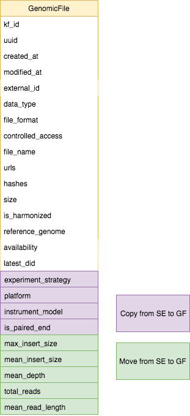

# Model Updates

## CavaticaTask Generalization
Up until this point we have only ingested harmonized files from Cavatica. Now we will also receive
harmonized files from the Broad Institute.

### Implementation
We need to rename the models and fields to generalize the CavaticaTask and CavaticaTaskGenomicFile models.

  

### Migration
Migration should be fairly simple. It will consist of alter columns and alter table commands.
Also, we don't have any data in cavatica_task, cavatica_task_genomic_files tables.

## Multi-specimen Genomic Files
We decided that we will not have a separate model to represent multi-specimen genomic files.
We will keep the many-to-many relationship between biospecimens and genomic files.

## Sequencing Experiments and Harmonized Files

A model change is needed to accommodate the use case: People want to search for harmonized genomic files by fields that describe the sequencing experiment that was performed on the associated unharmonized files.

See motivation for more details.

### Motivation
1. Really the "raw data" from a sequencing experiment is the read-level data, that is FASTQ, BAM, CRAMs - so they make the most sense to be directly tied to a sequencing experiment

2. Everything else, gVCF, VCF, etc is a processing level that is using that raw data to determine genomic variants/features, but they don't contain the reads themselves

3. However, when people are looking for variant data they typically want to search and filter by whether those gVCF/VCF came from whole genome vs whole exome, and now with newer platforms/instruments like pacbio/nanopore appearing it's likely also want to distinguish between Illumina and those

4. So to meet the searchability need with the current model we could either attach sequencing experiment directly to those files, resulting in many-to-many relationships, require the portal ETL to walk through the logic, or push the fields needed for searching onto the files themselves

### Design Considerations
Traditionally things like gVCF/VCFs were typically only created with one type of experimental strategy, but increasingly there have been new methods that include multiple strategies to improve power. For example, high depth whole exome sequencing combined with whole genome for wider coverage (this is actually how the Kids First sequencing is done for tumors) as well as combining RNA-seq with DNA methods as they're all different inspections of the same underlying information.

To address that potential if it was easy to utilize arrays that would help prevent unnecessary changes in the future. However, sounds like there is both some technical challenges as well as the consideration that we might want the search fields to say something like "WXS/WGS" versus bucketing them into the two categories.

### Model Change

\* Data types for fields below will remain unchanged. See SequencingExperiment
model definition for types.

1. Add the common SE fields to GenomicFile. Do not remove them from
SequencingExperiment yet (we want to keep them for now)

    - `experiment_strategy`
    - `platform`
    - `instrument_model`
    - `is_paired_end`

2. Move read group SE fields to GenomicFile.

    - `max_insert_size`
    - `mean_insert_size`
    - `mean_depth`
    - `total_reads`
    - `mean_read_length`

3. Update the enums:
    - `experiment_strategy`
        - Add `WGS and WXS`
        - Add `Multiple`
    - `platform`
        - Add `Multiple`
    - `instrument_model`
        - Add `Multiple`

  

### Migration
- Add the new columns (above) on genomic file
- Copy the values of these columns on the sequencing experiments to the columns
on the linked genomic files.
- Remove the read group SE columns from sequencing experiment.

### Data Ingest Workflow
1. Dataservice ingest before harmonization

    - Ingest sequencing experiments
    - Ingest and link unharmonized genomic files to sequencing experiments
    - Common SE fields should be populated on both the SEs and the GFs.
    - Since these are single specimen files the arrays (if we choose array type for these fields) for each field will just
    have one value

2. Harmonization

3. Dataservice ingest after harmonization

    - Ingest harmonized genomic files
    - Ingest tasks and task_genomic_files to create a mapping between unharmonized
    and harmonized genomic files
    - Populate common SE fields on harmonized genomic files -
        - For each harmonized genomic file, find the input genomic file which is
        the unharmonized genomic file
        - Copy the SE field values from the unharmonized files to the SE field
        values on the harmonized genomic files.

        \* This is where the array type might become useful.
        Although rare, a harmonized file could be linked to two unharmonized files, each
        with different values for experiment_strategy (or platform, or instrument_model or is_paired_end)
