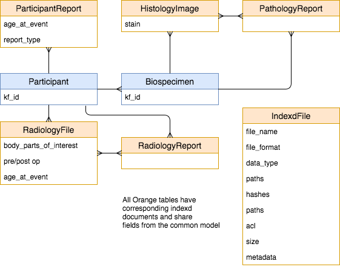

# Imaging and Report Model

## Motivation

Participants often have files in addition to genomic files ranging from
MRI images, histology images, and reports.
Some of these file types relate directly to the biospecimen rather than the
participant, eg: proteomics and histology.
In order to capture and distribute these files, we need to model them
appropriately.

## Implementation

Files will need to be distributed through gen3, so the models will need to
inherit the Indexd model similar to GenomicFiles.
Each new file type will have a unique prefix for the model as well as specific
metadata fields unique to that type of file.

### Radiology File and Report

RadiologyFile and RadiologyReport have a many-to-many relationship to
each-other and one-to-many from Participant.
When linking a file with a report, we must ensure that they both share the
same participant. This is similar to what we do when linking biospecimens and
diagnoses.

### Histology Image and Pathology Report

HistologyImage and PathologyReport have a many-to-many relationship with
each-other and they are both linked on-to-many from Biospecimen.
When linking an image with a report, we must ensure that they both share the
same biospecimen. This is similar to what we do when linking biospecimens and
diagnoses.

### ACLs

These file types are typically not submitted to dbGaP and so can not be
directly controlled through accession numbers and consents.
Instead, these files will have ACLs consisting of the study kf_id and
either the consent code from the attached biospecimen (if attached directly to
a biospecimen) or the most restrictive of all of the consent codes for that
participant's biospecimens (if attached to a participant).

### Migration of current files

Many MRI files have already been loaded as Genomic Files.
These files will need to be moved to RadiologyFiles.
Because this was intentionally done as a temporary solution, we will not make
an attempt to preserve the kf_ids given to the files.

## Difficulties

These models and data files are currently only supported by CBTTC with
only one additonal study in the future.
Will this model be utilized at some point across more studies, or is it
only being implemented to accomadate an outlier?

The model changes introduce many more file types which will result in many
more files being tracked in the dataservice and indexd.
Indexd is currently a bottleneck, and will likely remain one.
Will it be able to accommodate such an increase in quantity?
